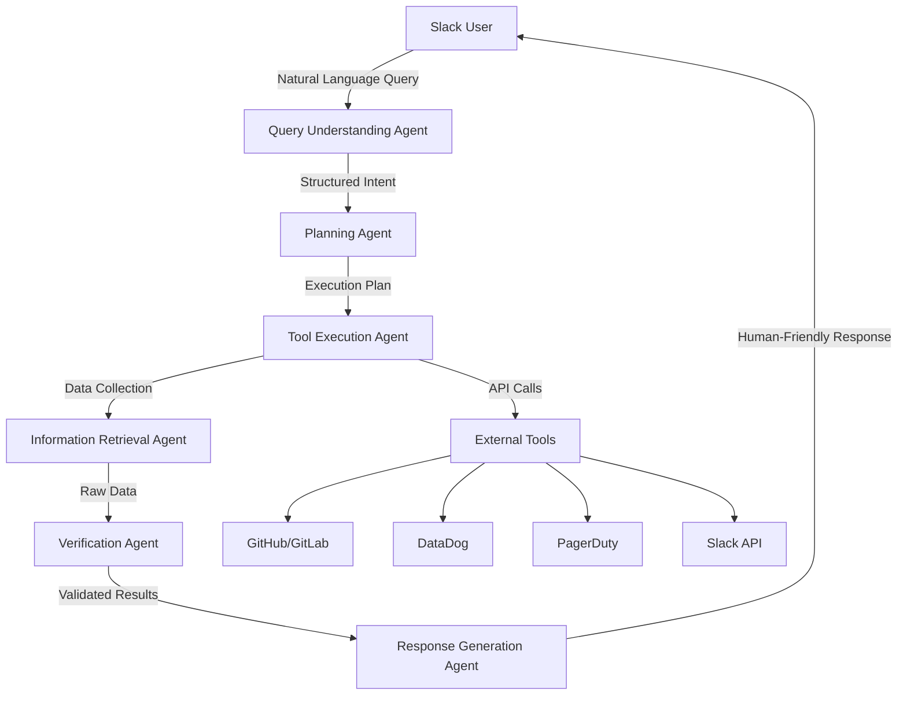
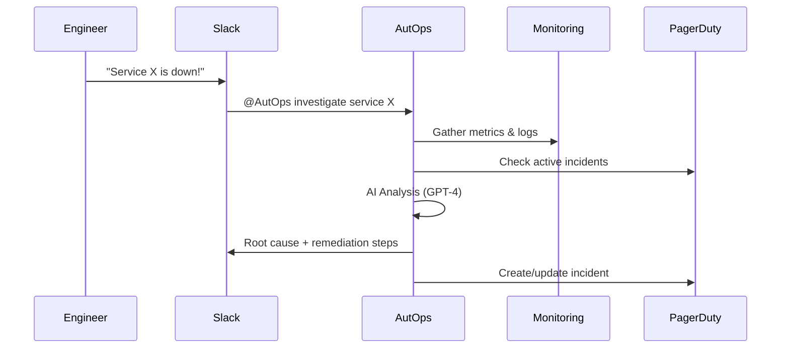

# 🤖 AutOps - AI-Powered DevOps Automation Platform

[](https://opensource.org/licenses/MIT)
[](https://www.python.org/downloads/)
[](https://fastapi.tiangolo.com/)
[](https://www.docker.com/)
[](https://kubernetes.io/)

> **An autonomous AI teammate for your entire engineering organization**

AutOps is an intelligent DevOps automation platform that combines multiple AI agents with real-world tool integrations to provide instant insights, automated incident response, and proactive system monitoring through natural language interactions.

## 📌 Current State (MVP Ready)

### ✅ What's Working
- **Core Agent System**: All 6 AI agents are functional and orchestrated
- **Slack Integration**: Full bi-directional communication with verification
- **GitHub Integration**: Real-time CI/CD status and repository information  
- **OpenAI Integration**: GPT-4 powered analysis and natural language understanding
- **Docker Deployment**: One-command setup with automated ngrok tunneling
- **Production Architecture**: FastAPI, Redis, proper logging, and error handling

### ⚠️ Limitations
- **GitLab, Datadog, PagerDuty**: Clients exist but implementations are stubbed
- **Database**: Currently using SQLite (PostgreSQL recommended for production)
- **Authentication**: No multi-workspace OAuth flow yet (manual bot token required)
- **Rate Limiting**: Configured but not enforced
- **Monitoring**: Prometheus/Grafana configs present but require setup

## 🌟 What is AutOps?

AutOps transforms how engineering teams interact with their infrastructure by providing:

- **🧠 Multi-Agent AI System**: Six specialized agents working together to understand, plan, execute, and verify DevOps operations
- **💬 Natural Language Interface**: Interact with your entire DevOps stack through Slack conversations
- **🔧 Real-Time Integrations**: Direct connections to GitHub, GitLab, DataDog, PagerDuty, and more
- **📊 Intelligent Monitoring**: Automated analysis with actionable insights and recommendations
- **🚀 Production-Ready**: Enterprise-grade observability, security, and scalability

## 🎯 Current Capabilities

### What AutOps Can Do Right Now

#### 🔍 **CI/CD Pipeline Monitoring**
```
@AutOps is the latest build passing for checkout-service?
```
- ✅ Real-time pipeline status from GitHub Actions/GitLab CI
- ✅ Build history and failure analysis
- ✅ Deployment tracking across environments

#### 🚨 **Incident Investigation & Response**
```
@AutOps payment-service is throwing 500s, what happened?
```
- ✅ Automated context gathering from multiple monitoring sources
- ✅ AI-powered root cause analysis using GPT-4
- ✅ Suggested remediation actions with confidence scores
- ✅ Integration with PagerDuty for incident management

#### 📈 **Performance & Health Monitoring**
```
@AutOps show me error rates for user-service in the last hour
```
- ✅ Real-time metrics from DataDog
- ✅ Service health dashboards
- ✅ Alert correlation and anomaly detection

## 🏗️ Architecture Overview

AutOps uses a **multi-agent architecture** where specialized AI agents collaborate to handle complex DevOps workflows:



### 🤖 The Six Agents

1. **Query Understanding Agent** - Parses natural language into structured intents
2. **Planning Agent** - Creates execution plans and provides AI-powered analysis
3. **Information Retrieval Agent** - Gathers data from multiple monitoring sources
4. **Tool Execution Agent** - Orchestrates API calls and agent coordination
5. **Verification Agent** - Validates results and provides workflow reflection
6. **Response Generation Agent** - Creates user-friendly responses and notifications

## 🚀 Quick Start (Under 10 Minutes!)

### Prerequisites

- **Docker & Docker Compose** (required)
- **Ngrok** (installed automatically by setup script)
- **Slack workspace** with admin access
- **API Keys**: OpenAI, GitHub (minimum required)

### 1. Clone and Setup

```bash
# Clone the repository
git clone https://github.com/yourusername/autops.git
cd autops

# Copy environment template
cp .env.example .env

# Edit .env and add your API keys (required fields are marked)
nano .env  # or use your favorite editor
```

### 2. One-Command Setup

```bash
# This script will:
# - Validate your environment
# - Start all services via Docker
# - Create an ngrok tunnel
# - Show you the URLs for Slack configuration
./scripts/dev.sh
```

### 3. Required API Keys

You'll need these minimum keys to get started:

| Service | Required | Where to Get |
|---------|----------|--------------|
| **OpenAI** | ✅ Yes | [platform.openai.com/api-keys](https://platform.openai.com/api-keys) |
| **Slack** | ✅ Yes | Created in step 4 below |
| **GitHub** | ✅ Yes | [github.com/settings/tokens](https://github.com/settings/tokens) |
| **Others** | ❌ Optional | Can be added later |

**Quick .env Setup:**
```bash
# Minimum required configuration
OPENAI_API_KEY=sk-...                 # [REQUIRED] Your OpenAI API key
SLACK_BOT_TOKEN=xoxb-...              # [REQUIRED] From Slack app setup
SLACK_SIGNING_SECRET=...              # [REQUIRED] From Slack app setup  
GITHUB_TOKEN=ghp_...                  # [REQUIRED] Personal access token
GITHUB_OWNER=your-org                 # [REQUIRED] Your GitHub username/org
```

### 4. Slack App Setup

Follow our **[Complete Slack Setup Guide](docs/SLACK_APP_SETUP.md)** for detailed instructions with screenshots.

**Quick Steps:**
1. Go to [api.slack.com/apps](https://api.slack.com/apps) → Create New App
2. Copy credentials to your `.env` file
3. Add Bot Token Scopes (list provided in guide)
4. Configure Event Subscriptions with your ngrok URL
5. Install to your workspace

### 5. Test Your Bot

Once the setup script shows your ngrok URL:

Invite the bot to a channel and try:
```
@AutOps hi there!
@AutOps is the latest build passing for my-service?
@AutOps investigate incidents for payment-service
```

## 🔧 Integration Guide

### Integrating AutOps into Your Workflow

#### 1. **Incident Response Workflow**



#### 2. **Daily Standup Integration**

Set up scheduled queries for team updates:
```
@AutOps daily health check for all services
@AutOps show yesterday's deployments
@AutOps any critical alerts overnight?
```

#### 3. **Release Management**

```
@AutOps deploy status for release-v2.1.0
@AutOps rollback user-service to previous version
@AutOps compare performance before/after deployment
```

### 🔌 Supported Integrations

| Tool | Status | Capabilities |
|------|--------|-------------|
| **GitHub** | ✅ Production | Pipeline status, repository operations, CI/CD insights |
| **GitLab** | ✅ Production | Deployment tracking, pipeline monitoring, commit analysis |
| **DataDog** | ✅ Production | Metrics, events, monitors, service health |
| **PagerDuty** | ✅ Production | Incident management, on-call schedules, alert correlation |
| **Slack** | ✅ Production | Primary interface, notifications, interactive responses |
| **Prometheus** | ✅ Production | Built-in metrics collection and monitoring |

## 📊 Monitoring & Observability

AutOps includes comprehensive observability out of the box:

### Built-in Dashboards

- **Grafana Dashboards**: Pre-configured monitoring for AutOps performance
- **Prometheus Metrics**: Agent execution times, success rates, API health
- **Structured Logging**: JSON logs for easy parsing and analysis

### Health Endpoints

- `/health` - Basic health check
- `/ready` - Readiness probe for Kubernetes
- `/metrics` - Prometheus metrics endpoint

### Key Metrics Tracked

- Agent execution duration and success rates
- External API response times and error rates
- User query patterns and response quality
- System resource utilization

## 🚀 Deployment Options

### Local Development
```bash
make run-dev
```

### Docker Compose (Full Stack)
```bash
make run-docker
```

### Kubernetes (Production)
```bash
# Apply production manifests
make apply-k8s-prod

# Or customize for your environment
kubectl apply -f k8s/
```

### Cloud Platforms

AutOps is designed to run on any container platform:
- **AWS EKS/ECS**
- **Google GKE**
- **Azure AKS**
- **DigitalOcean Kubernetes**
- **Render/Railway/Fly.io**

## 🧪 Demo Mode

Want to try AutOps without setting up all the external integrations? Enable mock mode:

```env
USE_MOCK_DATA=true
```

This allows you to:
- ✅ Test the complete agent workflow
- ✅ See realistic responses with dummy data
- ✅ Record demos for presentations
- ✅ Develop new features without API dependencies

## 🧪 Testing & Quality Assurance

### Running Tests

```bash
# Run all tests
make test

# Run with coverage (requires 80%+ coverage)
make test-coverage

# Run specific test categories
pytest tests/unit/          # Unit tests
pytest tests/integration/   # Integration tests
pytest tests/test_comprehensive.py -v  # Comprehensive test suite

# Run tests in parallel
pytest -n auto tests/
```

### Performance Benchmarking

AutOps includes comprehensive performance testing with Locust:

```bash
# Start AutOps server
make run-dev

# Run performance tests (in another terminal)
locust -f benchmarks/locustfile.py --host=http://localhost:8000

# Headless benchmark for CI/CD
locust -f benchmarks/locustfile.py --host=http://localhost:8000 \
  --users 10 --spawn-rate 2 --run-time 30s --headless

# Quick health check benchmark
locust -f benchmarks/locustfile.py --host=http://localhost:8000 \
  -u 5 -r 1 -t 10s --headless --only-summary
```

### Performance Targets

- **Health endpoint**: < 100ms response time
- **Slack events**: < 3 seconds processing time  
- **Agent workflows**: < 30 seconds end-to-end
- **Concurrent users**: Support 100+ simultaneous requests
- **Memory usage**: < 512MB under normal load

### Code Quality Checks

```bash
make lint              # Flake8 + Black formatting
make type-check        # MyPy type checking
make security-scan     # Bandit security analysis
make quality-gate      # All quality checks combined
```

## 🛠️ Development

### Project Structure

```
autops/
├── src/autops/
│   ├── agents/           # Six AI agents
│   ├── api/             # FastAPI routes and webhooks
│   ├── tools/           # External service clients
│   ├── utils/           # Logging, exceptions, helpers
│   └── config.py        # Configuration management
├── tests/               # Comprehensive test suite
├── k8s/                # Kubernetes manifests
├── monitoring/         # Grafana/Prometheus configs
├── scripts/            # Deployment and utility scripts
└── docker-compose.yml  # Local development stack
```

### Running Tests

```bash
make test              # Run all tests
make test-coverage     # Run with coverage report
make lint             # Code quality checks
make security-scan    # Security vulnerability scan
```

### Code Quality

AutOps maintains high code quality with:
- **Black** formatting
- **Flake8** linting  
- **MyPy** type checking
- **Bandit** security scanning
- **Pre-commit hooks**

## 🔐 Security

### Production Security Features

- **Input validation** on all user inputs
- **Rate limiting** to prevent abuse
- **Secrets management** via environment variables
- **Non-root container** execution
- **Security scanning** in CI/CD pipeline
- **Encrypted communication** with external APIs

### Security Best Practices

1. **Rotate API keys** regularly
2. **Use least-privilege** access for service accounts
3. **Monitor logs** for suspicious activity
4. **Keep dependencies** updated
5. **Review audit logs** periodically

## 🤝 Contributing

We welcome contributions! Please see our [Contributing Guide](CONTRIBUTING.md) for details.

### How to Contribute

1. **Fork** the repository
2. **Create** a feature branch (`git checkout -b feature/amazing-feature`)
3. **Commit** your changes (`git commit -m 'Add amazing feature'`)
4. **Push** to the branch (`git push origin feature/amazing-feature`)
5. **Open** a Pull Request

### Development Setup

```bash
# Clone your fork
git clone https://github.com/yourusername/autops.git
cd autops

# Install development dependencies
make dev-setup

# Run in development mode
make run-dev

# Run tests before committing
make test-all
```

## 🗺️ Roadmap

### Current Status: **Production MVP** ✅

- ✅ Multi-agent architecture
- ✅ Slack integration
- ✅ Core DevOps tool integrations
- ✅ Kubernetes deployment
- ✅ Comprehensive monitoring

### Coming Soon

- 🔄 **Enhanced AI Capabilities**
  - Multi-step reasoning chains
  - Learning from historical incidents
  - Predictive anomaly detection

- 🔄 **Extended Integrations**
  - AWS/GCP/Azure cloud platforms
  - Terraform/Pulumi infrastructure
  - Jenkins/CircleCI/Travis CI

- 🔄 **Advanced Features**
  - Visual workflow builder
  - Custom agent development SDK
  - Multi-tenant support

### Long-term Vision

- 🎯 **Autonomous Operations**: Self-healing infrastructure with minimal human intervention
- 🎯 **Universal Integration**: Connect to any tool via natural language descriptions
- 🎯 **Intelligent Learning**: Continuously improve from team interactions and outcomes

## 📄 License

This project is licensed under the MIT License - see the [LICENSE](LICENSE) file for details.

## 🙏 Acknowledgments

- **OpenAI** for GPT-4 capabilities
- **FastAPI** for the excellent web framework
- **Slack** for the platform and APIs
- **The DevOps Community** for inspiration and feedback

## 📞 Support & Community

- **GitHub Issues**: [Report bugs or request features](https://github.com/yourusername/autops/issues)
- **Discussions**: [Join the community](https://github.com/yourusername/autops/discussions)
- **Discord**: [Join our Discord server](https://discord.gg/autops) *(coming soon)*

---

**Made with ❤️ by the AutOps community**

*AutOps - Because your infrastructure deserves an AI teammate.*

## Development Environment Setup

### Code Formatting
This project uses Black for code formatting. **Important:** The CI environment uses Black 23.12.1 as specified in `pyproject.toml`. To ensure compatibility:

```bash
# Install the exact Black version used in CI
pip install black==23.12.1

# Format code
black src tests

# Check formatting
black --check src tests
```

**Note:** Different Black versions may format code differently. Always use the version specified in `pyproject.toml` to avoid CI formatting failures.
